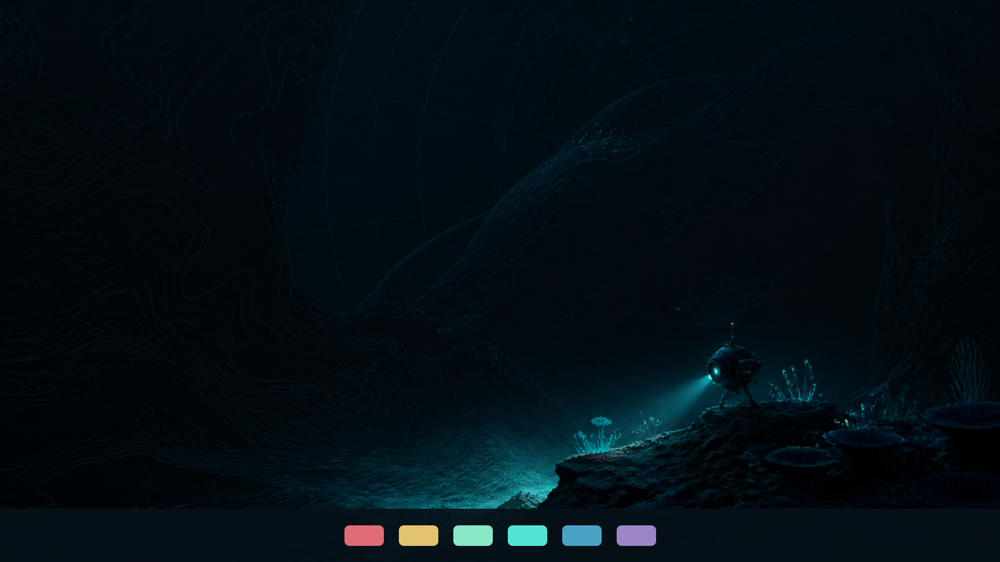
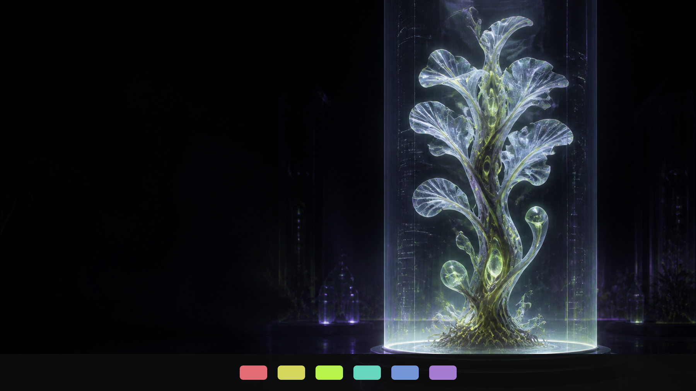
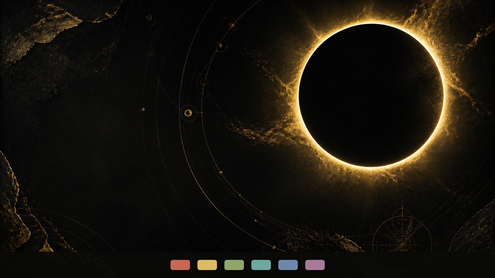
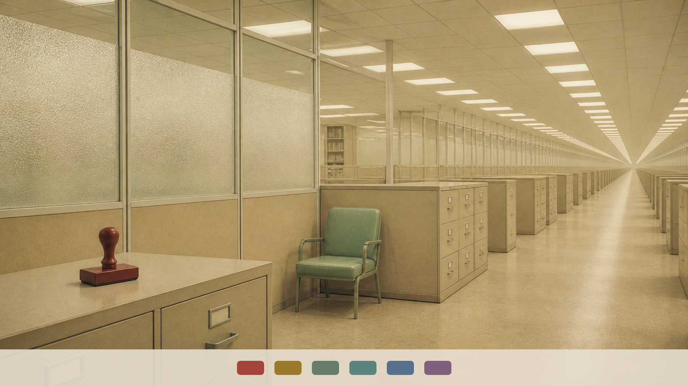
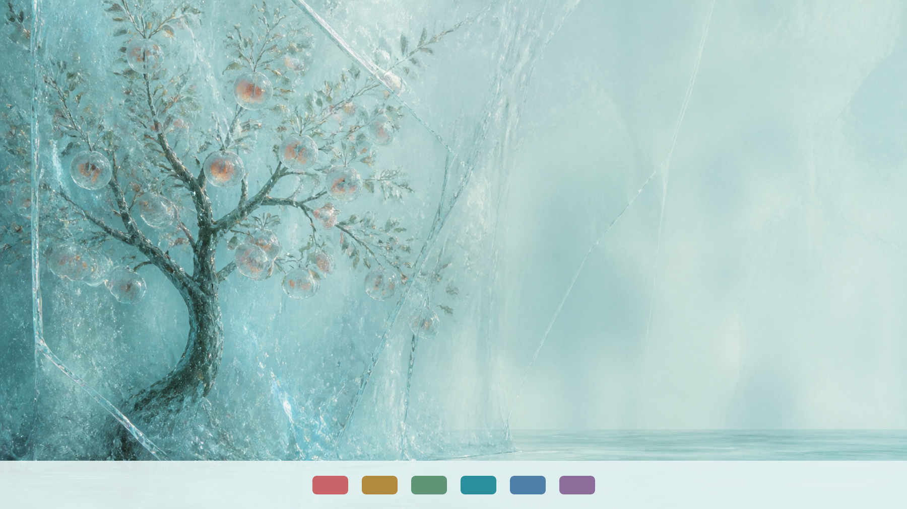
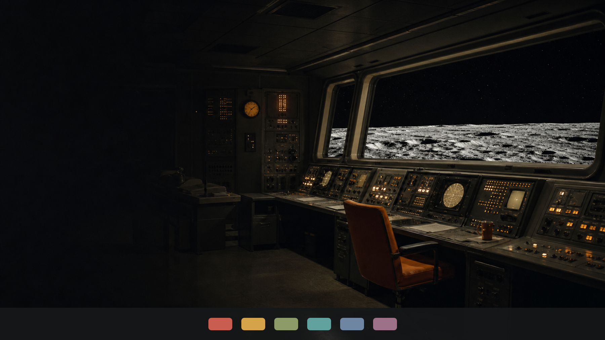
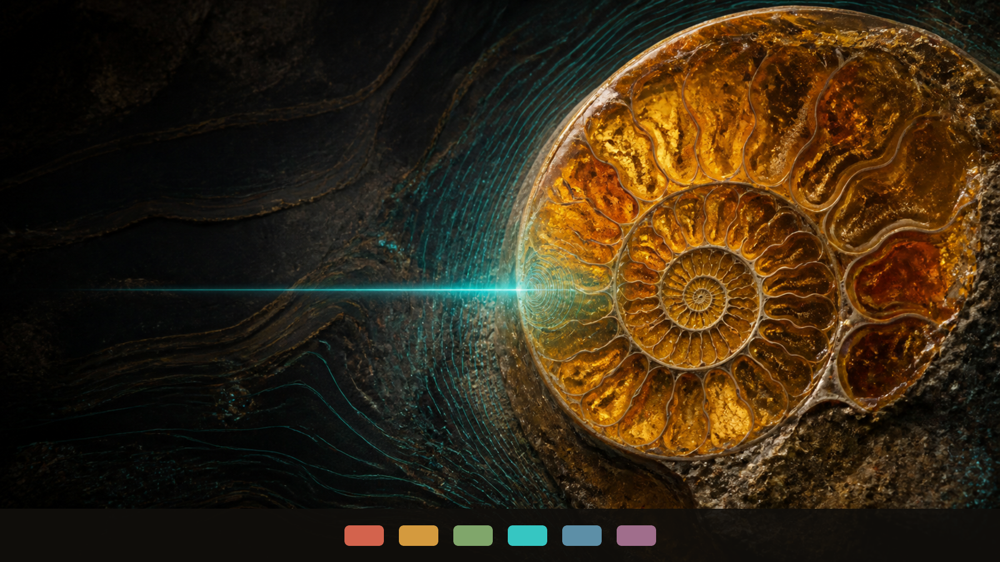
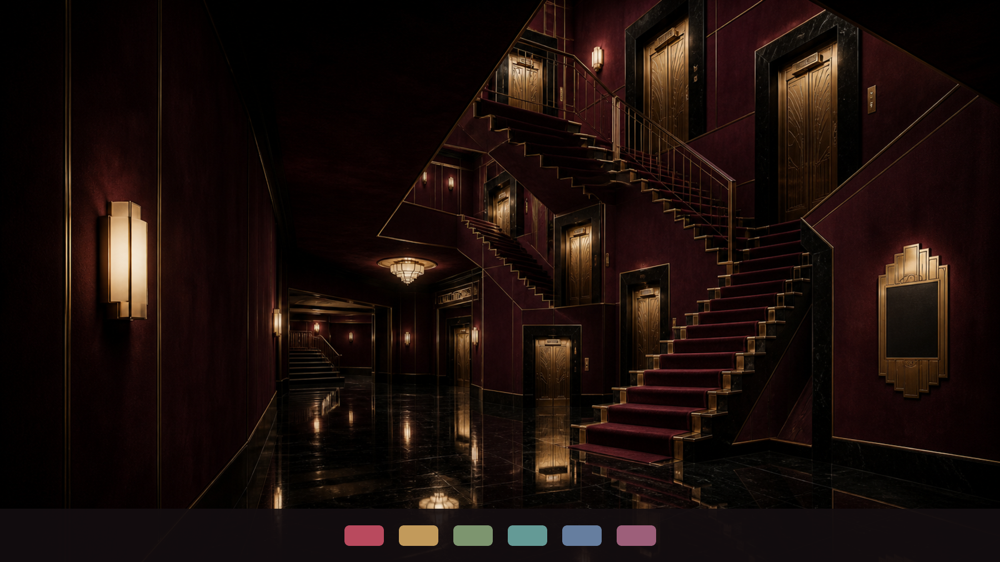

# Omarchy Dreamscapes

Ten original Omarchy themes built as tiny worlds rather than palette swaps. Every theme includes a complete generated color system, two original wallpapers, coordinated lock-screen styling, and an icon-theme selection.

## The collection

| Theme | Mode | Install |
| --- | --- | --- |
| [Abyssal Cartographer](https://github.com/leaflessbranch/omarchy-abyssal-cartographer-theme) | Dark | `omarchy theme install https://github.com/leaflessbranch/omarchy-abyssal-cartographer-theme.git` |
| [Xenobotany Lab No. 7](https://github.com/leaflessbranch/omarchy-xenobotany-lab-no-7-theme) | Dark | `omarchy theme install https://github.com/leaflessbranch/omarchy-xenobotany-lab-no-7-theme.git` |
| [Solar Relic](https://github.com/leaflessbranch/omarchy-solar-relic-theme) | Dark | `omarchy theme install https://github.com/leaflessbranch/omarchy-solar-relic-theme.git` |
| [Dream Bureaucracy](https://github.com/leaflessbranch/omarchy-dream-bureaucracy-theme) | Light | `omarchy theme install https://github.com/leaflessbranch/omarchy-dream-bureaucracy-theme.git` |
| [Cathedral of Static](https://github.com/leaflessbranch/omarchy-cathedral-of-static-theme) | Dark | `omarchy theme install https://github.com/leaflessbranch/omarchy-cathedral-of-static-theme.git` |
| [Cryogenic Orchard](https://github.com/leaflessbranch/omarchy-cryogenic-orchard-theme) | Light | `omarchy theme install https://github.com/leaflessbranch/omarchy-cryogenic-orchard-theme.git` |
| [Apollo After Dark](https://github.com/leaflessbranch/omarchy-apollo-after-dark-theme) | Dark | `omarchy theme install https://github.com/leaflessbranch/omarchy-apollo-after-dark-theme.git` |
| [Living Ink](https://github.com/leaflessbranch/omarchy-living-ink-theme) | Light | `omarchy theme install https://github.com/leaflessbranch/omarchy-living-ink-theme.git` |
| [Neon Fossil](https://github.com/leaflessbranch/omarchy-neon-fossil-theme) | Dark | `omarchy theme install https://github.com/leaflessbranch/omarchy-neon-fossil-theme.git` |
| [The Impossible Hotel](https://github.com/leaflessbranch/omarchy-the-impossible-hotel-theme) | Dark | `omarchy theme install https://github.com/leaflessbranch/omarchy-the-impossible-hotel-theme.git` |

### Abyssal Cartographer



### Xenobotany Lab No. 7



### Solar Relic



### Dream Bureaucracy



### Cathedral of Static


### Cryogenic Orchard



### Apollo After Dark



### Living Ink


### Neon Fossil



### The Impossible Hotel



## Install everything

Review [install-all-themes](install-all-themes), then run:

```bash
./install-all-themes
```

The standard Omarchy installation commands are intentionally preserved: every theme remains independently installable, updateable with `omarchy theme update`, and removable through `omarchy theme remove`.

## Optional Experience Pack

The themes are complete without this. The opt-in [Experience Pack](experience-pack/README.md) adds:

- Theme-specific Hyprland gaps, rounding, blur, borders, and opacity
- Theme-aware workspace labels
- A command and optional keybinding for cycling all ten themes

Its installer backs up every user configuration file it changes and its uninstaller removes only Dreamscapes-owned files.

## Compatibility

Developed and locally tested with Omarchy 4.0.0-1. The repositories use the modern `colors.toml` theme format.

## Artwork

The original wallpapers were generated with OpenAI image generation and curated by Eddie ([leaflessbranch](https://github.com/leaflessbranch)). Individual artwork terms are included in each theme repository.

Code in this collection repository is released under the MIT License.
